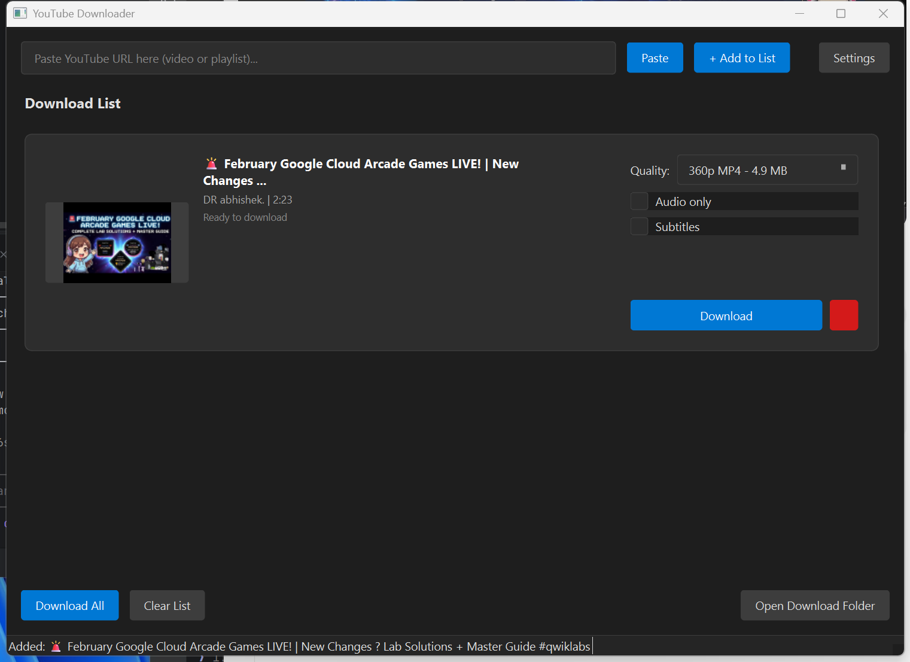

# YouTube Downloader

A modern desktop application for downloading YouTube videos with a clean, user-friendly interface built with PyQt6.



## Features

- **Video Downloads**: Download videos in various qualities from 360p to 4K
- **High Quality Support**: Download 1080p, 1440p, and 4K videos (requires FFmpeg)
- **Audio Extraction**: Extract audio-only as MP3
- **Batch Downloads**: Add multiple videos to queue and download all at once
- **Playlist Support**: Paste playlist URLs to add all videos automatically
- **Subtitle Download**: Download subtitles as .srt files
- **Thumbnail Preview**: See video thumbnails before downloading
- **Progress Tracking**: Real-time progress bar and status updates
- **Dark/Light Theme**: Choose your preferred appearance
- **Configurable Settings**: Set download folder, concurrent downloads, default quality

## Screenshot

The application features a clean, modern interface:

- **URL Input**: Paste any YouTube video or playlist URL
- **Download Button**: Quickly fetch video information and add to list
- **Video Cards**: Each video shows thumbnail, title, channel, duration
- **Quality Selection**: Choose from all available quality options
- **Audio Only**: Check to download only audio track
- **Subtitles**: Check to download captions as .srt file
- **Download All**: Start downloading all videos in queue
- **Settings**: Configure download folder, theme, and more

---

## Quick Start

```bash
# 1. Clone or download the source code
git clone https://github.com/yourusername/YoutubeDownload.git
cd YoutubeDownload

# 2. Install dependencies
pip install -r requirements.txt

# 3. Run the application
python main.py
```

---

## Download Source Code

### Option 1: Git Clone (Recommended)

```bash
git clone https://github.com/yourusername/YoutubeDownload.git
cd YoutubeDownload
```

### Option 2: Download ZIP

1. Go to the repository page
2. Click the green **"Code"** button
3. Select **"Download ZIP"**
4. Extract the ZIP file to your desired location

### Option 3: Manual Copy

Copy all files maintaining this structure:

```
YoutubeDownload/
├── main.py
├── requirements.txt
├── ui/
│   ├── __init__.py
│   ├── main_window.py
│   ├── video_item_widget.py
│   ├── settings_dialog.py
│   └── styles.py
└── core/
    ├── __init__.py
    ├── downloader.py
    ├── video_info.py
    └── utils.py
```

---

## Installation

### Prerequisites

| Requirement | Version | Purpose |
|-------------|---------|---------|
| Python | 3.10+ | Runtime environment |
| PyQt6 | 6.4+ | GUI framework |
| pytubefix | 5.0+ | YouTube API |
| requests | 2.28+ | HTTP requests |
| FFmpeg | Any | Video/audio merging (optional) |

### Step 1: Install Python

**Windows:**
- Download from https://www.python.org/downloads/
- Check "Add Python to PATH" during installation

**Verify installation:**
```bash
python --version
# Should show: Python 3.10.x or higher
```

### Step 2: Install FFmpeg (Required for HD/4K)

FFmpeg is needed to merge video and audio streams for high-quality downloads (1080p+).

**Windows - Option A: Manual Install**
1. Download from https://ffmpeg.org/download.html (choose "Windows builds")
2. Download the "full" build from gyan.dev or BtbN
3. Extract to `C:\ffmpeg`
4. Add to PATH:
   - Open System Properties > Environment Variables
   - Edit "Path" under System Variables
   - Add `C:\ffmpeg\bin`
   - Click OK and restart terminal

**Windows - Option B: Using Chocolatey**
```bash
choco install ffmpeg
```

**Windows - Option C: Using Scoop**
```bash
scoop install ffmpeg
```

**Windows - Option D: Using winget**
```bash
winget install FFmpeg
```

**Verify FFmpeg installation:**
```bash
ffmpeg -version
# Should show: ffmpeg version x.x.x
```

### Step 3: Install Python Dependencies

```bash
# Navigate to project folder
cd YoutubeDownload

# Install all dependencies
pip install -r requirements.txt
```

**Or install individually:**
```bash
pip install PyQt6>=6.4.0
pip install pytubefix>=5.0.0
pip install requests>=2.28.0
```

### Step 4: Verify Installation

```bash
python -c "import PyQt6; import pytubefix; import requests; print('All dependencies OK!')"
```

---

## Usage

### Running the Application

```bash
cd YoutubeDownload
python main.py
```

### How to Download a Video

1. **Copy a YouTube URL** from your browser
2. **Click "Paste"** or paste directly into the URL field
3. **Click "Download"** to fetch video information
4. **Select Quality** from the dropdown menu:
   - Resolutions marked "(video only)" require FFmpeg for audio merging
   - Progressive streams (with audio) work without FFmpeg
5. **Optional**: Check "Audio only" for MP3 extraction
6. **Optional**: Check "Subtitles" to download captions
7. **Click "Download"** on the video card to start

### Downloading Playlists

1. Copy a YouTube playlist URL (contains `&list=` or `playlist?list=`)
2. Paste and click "Download"
3. All videos from the playlist will be added to the list
4. Click "Download All" to download everything

### Supported URL Formats

| URL Type | Example |
|----------|---------|
| Standard Video | `https://www.youtube.com/watch?v=VIDEO_ID` |
| Short URL | `https://youtu.be/VIDEO_ID` |
| Shorts | `https://www.youtube.com/shorts/VIDEO_ID` |
| Playlist | `https://www.youtube.com/playlist?list=PLAYLIST_ID` |
| Video in Playlist | `https://www.youtube.com/watch?v=VIDEO_ID&list=PLAYLIST_ID` |

### Quality Options Explained

| Quality | Type | FFmpeg Required | File Size (10 min video) |
|---------|------|-----------------|--------------------------|
| 2160p/4K (video only) | Adaptive | Yes | ~500-800 MB |
| 1440p (video only) | Adaptive | Yes | ~300-500 MB |
| 1080p (video only) | Adaptive | Yes | ~150-300 MB |
| 720p MP4 | Progressive | No | ~80-150 MB |
| 720p (video only) | Adaptive | Yes | ~80-150 MB |
| 480p (video only) | Adaptive | Yes | ~50-80 MB |
| 360p MP4 | Progressive | No | ~30-50 MB |
| Audio 128kbps | Audio | No | ~10 MB |

**Note**: "video only" streams are higher quality but need FFmpeg to merge with audio. The app will automatically download the best audio and merge it for you.

---

## Settings

Access settings by clicking the **"Settings"** button:

| Setting | Description | Default |
|---------|-------------|---------|
| Download Folder | Where videos are saved | `~/Downloads/YouTubeDownloads` |
| Concurrent Downloads | Simultaneous downloads (1-5) | 2 |
| Default Quality | Auto-selected quality for new videos | Highest Available |
| Auto Subtitles | Automatically enable subtitle download | Off |
| Subtitle Language | Preferred caption language | English |
| Dark Mode | Toggle dark/light theme | On |

**Settings file location:** `~/.youtube_downloader_settings.json`

---

## Project Structure

```
YoutubeDownload/
├── main.py                 # Application entry point
├── requirements.txt        # Python dependencies
├── README.md               # This documentation
├── ScreenShot.png          # Application screenshot
│
├── ui/                     # User interface components
│   ├── __init__.py         # Package initialization
│   ├── main_window.py      # Main application window (388 lines)
│   │                       # - URL input and parsing
│   │                       # - Video list management
│   │                       # - Settings handling
│   │
│   ├── video_item_widget.py # Video card component (290 lines)
│   │                       # - Thumbnail display
│   │                       # - Quality selection
│   │                       # - Progress bar
│   │                       # - Download controls
│   │
│   ├── settings_dialog.py  # Settings dialog (167 lines)
│   │                       # - Download folder selection
│   │                       # - Theme toggle
│   │                       # - Preference management
│   │
│   └── styles.py           # QSS stylesheets (538 lines)
│                           # - Dark theme
│                           # - Light theme
│
├── core/                   # Core functionality
│   ├── __init__.py         # Package initialization
│   ├── downloader.py       # Download manager (350+ lines)
│   │                       # - QThread-based workers
│   │                       # - Progress callbacks
│   │                       # - FFmpeg merging
│   │                       # - Queue management
│   │
│   ├── video_info.py       # Video metadata (210 lines)
│   │                       # - YouTube API integration
│   │                       # - Stream parsing
│   │                       # - Thumbnail fetching
│   │                       # - Caption detection
│   │
│   └── utils.py            # Helper functions (95 lines)
│                           # - File size formatting
│                           # - Duration formatting
│                           # - URL parsing
│                           # - Filename sanitization
│
└── resources/
    └── icons/              # Application icons (optional)
```

---

## Code Documentation

### Core Classes

#### `DownloadManager` (core/downloader.py)
Manages download queue and worker threads.

```python
from core.downloader import DownloadManager

manager = DownloadManager(max_concurrent=2)
manager.set_output_path("/path/to/downloads")

# Add a download task
task_id = manager.add_task(
    video_info=video_info,
    itag=22,  # Stream itag
    audio_only=False,
    subtitles=True,
    subtitle_lang="en"
)

# Start downloading
manager.start_task(task_id)

# Or start all pending tasks
manager.start_all()
```

#### `VideoInfoFetcher` (core/video_info.py)
Fetches video metadata asynchronously.

```python
from core.video_info import VideoInfoFetcher

fetcher = VideoInfoFetcher()
fetcher.video_info_ready.connect(on_video_ready)
fetcher.error.connect(on_error)
fetcher.fetch_url("https://youtube.com/watch?v=...")
```

#### `VideoInfo` (core/video_info.py)
Data class containing video metadata.

```python
@dataclass
class VideoInfo:
    url: str
    video_id: str
    title: str
    author: str
    duration: int  # seconds
    thumbnail_url: str
    streams: List[StreamInfo]
    audio_streams: List[StreamInfo]
    captions: List[CaptionInfo]
    thumbnail_data: bytes
```

#### `StreamInfo` (core/video_info.py)
Data class for stream information.

```python
@dataclass
class StreamInfo:
    itag: int
    resolution: str  # "1080p", "720p", etc.
    mime_type: str   # "video/mp4"
    filesize: int    # bytes
    is_progressive: bool  # True if contains audio
    is_audio_only: bool
    abr: str  # Audio bitrate "128kbps"
```

### Utility Functions

```python
from core.utils import (
    format_size,      # format_size(1024) -> "1.0 KB"
    format_duration,  # format_duration(3661) -> "1:01:01"
    sanitize_filename,# sanitize_filename("a/b:c") -> "abc"
    parse_urls,       # parse_urls(text) -> ["url1", "url2"]
    is_playlist_url,  # is_playlist_url(url) -> True/False
)
```

---

## Building Standalone Executable

### Using PyInstaller

```bash
# Install PyInstaller
pip install pyinstaller

# Build executable (single file)
pyinstaller --onefile --windowed --name "YouTubeDownloader" main.py

# Build executable (folder mode, faster startup)
pyinstaller --onedir --windowed --name "YouTubeDownloader" main.py
```

**Output location:** `dist/YouTubeDownloader.exe`

### Using auto-py-to-exe (GUI)

```bash
pip install auto-py-to-exe
auto-py-to-exe
```

Then configure:
- Script Location: `main.py`
- One File / One Directory
- Window Based (hide console)
- Add icon if desired

---

## Troubleshooting

### "FFmpeg required for high-quality downloads"

This error appears when selecting 1080p or higher quality without FFmpeg installed.

**Solutions:**
1. Install FFmpeg (see Installation section)
2. Or select a lower quality (720p or 360p) that doesn't require FFmpeg

### "No streams available"

This can happen if:
- The video is private or age-restricted
- The video is not available in your region
- YouTube has changed their API

**Solutions:**
```bash
# Update pytubefix to latest version
pip install --upgrade pytubefix
```

### Video downloads but no audio

FFmpeg is not properly installed or not in PATH.

**Verify:**
```bash
ffmpeg -version
```

If not found, reinstall FFmpeg and ensure it's in your PATH.

### Slow downloads

- Check your internet connection
- Try reducing concurrent downloads in Settings
- Some videos may have slow servers
- Try a different quality

### Application won't start

**Check Python version:**
```bash
python --version  # Need 3.10+
```

**Reinstall dependencies:**
```bash
pip uninstall PyQt6 pytubefix requests
pip install -r requirements.txt
```

### Import errors

```bash
# Make sure you're in the correct directory
cd YoutubeDownload

# Verify all files exist
ls -la main.py ui/ core/
```

---

## Dependencies

| Package | Version | Purpose | License |
|---------|---------|---------|---------|
| PyQt6 | 6.4+ | GUI framework | GPL v3 |
| pytubefix | 5.0+ | YouTube downloading | MIT |
| requests | 2.28+ | HTTP library | Apache 2.0 |
| FFmpeg | Any | Media processing | LGPL/GPL |

### Installing Specific Versions

```bash
pip install PyQt6==6.6.1
pip install pytubefix==5.6.3
pip install requests==2.31.0
```

---

## Version History

| Version | Date | Changes |
|---------|------|---------|
| 1.0.0 | 2024-02 | Initial release |
| | | - Basic video downloading |
| | | - Quality selection |
| | | - Dark/light themes |
| | | - Playlist support |
| | | - FFmpeg integration for HD |
| | | - Subtitle download |
| | | - Batch downloads |

---

## Future Improvements

- [ ] Download speed display
- [ ] ETA calculation
- [ ] Download history
- [ ] Scheduled downloads
- [ ] Browser extension integration
- [ ] Proxy support
- [ ] Format conversion options
- [ ] Thumbnail extraction
- [ ] Chapter markers support

---

## License

This project is for educational purposes. Please respect YouTube's Terms of Service and only download videos you have permission to download.

---

## Contributing

Contributions are welcome!

1. Fork the repository
2. Create a feature branch (`git checkout -b feature/amazing-feature`)
3. Commit your changes (`git commit -m 'Add amazing feature'`)
4. Push to the branch (`git push origin feature/amazing-feature`)
5. Open a Pull Request

---

## Support

If you encounter issues:

1. Check the Troubleshooting section above
2. Search existing issues
3. Create a new issue with:
   - Python version (`python --version`)
   - Operating system
   - Error message (full traceback)
   - Steps to reproduce

---

## Acknowledgments

- [pytubefix](https://github.com/JuanBindez/pytubefix) - YouTube API library
- [PyQt6](https://www.riverbankcomputing.com/software/pyqt/) - GUI framework
- [FFmpeg](https://ffmpeg.org/) - Media processing
